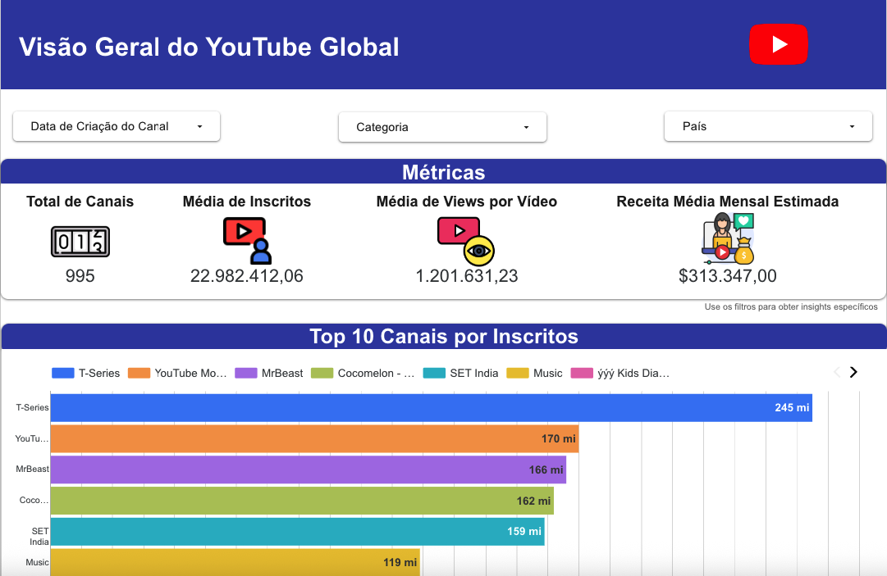

# 📊 Painel Global de Estatísticas do YouTube

## 🌐 Visão Geral

Este projeto analisa um conjunto de dados de estatísticas globais do YouTube de 2023, com foco nos canais mais assinados. O objetivo é fornecer insights sobre os principais criadores, categorias de conteúdo, distribuição geográfica e a relação entre desempenho no YouTube e indicadores socioeconômicos.

- 🛠️ **Dashboard:** Google Looker Studio  
- 🐍 **Processamento de Dados:** Python (Google Colab)  
- ☁️ **Armazenamento e Consulta:** Google BigQuery

---

## 📊 Acesse o Dashboard Interativo

🔗 Clique na imagem acima ou acesse diretamente pelo link:  
[https://lookerstudio.google.com/s/rO51oyUHq1g](https://lookerstudio.google.com/s/rO51oyUHq1g)

---

## 📁 Fonte de Dados

**Dataset:** [Estatísticas Globais do YouTube 2023 – Kaggle](https://www.kaggle.com/datasets/nelgiriyewithana/global-youtube-statistics-2023/data)  
📌 Contém dados sobre assinantes, visualizações, uploads, países, ganhos e dados socioeconômicos.

---

## 🔄 Processamento de Dados

1. 🧹 **Transformação em Python (Colab):**
   - Tratamento de valores ausentes
   - Renomeação de colunas
   - Construção de coluna de data a partir de `created_year`, `created_month` e `created_date`

2. 🗃️ **Tabela no BigQuery:**
   - CSV processado carregado no BigQuery

3. 🔍 **View no BigQuery:**
   - `created_month` (texto) convertido para numérico para fins de visualização

4. 📈 **Criação do Dashboard (Looker Studio):**
   - Dashboard multi-páginas construído usando o conjunto de dados e as views transformadas

---

## 🗺️ Estrutura do Dashboard e Insights

### 🔹 Página 1 – Visão Geral Global do YouTube

**🧭 Filtros:**  
- **Período:** Permite análise de tendências ao longo do tempo.  
- **Categoria:** Permite focar em tipos específicos de canais do YouTube.  
- **País:** Facilita comparações de desempenho entre diferentes regiões.

**📌 KPIs:**  
- Total de Canais  
- Média de Assinantes  
- Média de Visualizações por Vídeo  
- Média de Ganhos Mensais  

**📊 Gráficos e Insights:**
- **Top 10 Canais por Assinantes:**
  - T-Series lidera com folga com 245 milhões de assinantes.
  - YouTube Movies e MrBeast disputam de perto a segunda posição.
  - O top 10 inclui diversos tipos de conteúdo (música, infantil, entretenimento, mídia).
  - Quatro canais são voltados para conteúdo infantil.
  - O alto número de assinantes desses canais indica uma considerável barreira de entrada para novos canais alcançarem esse nível de popularidade e alcance.

- **Canais por Categoria:**  
  - "Entretenimento" tem o maior número de canais (256).
  - "Música" aparece em segundo lugar com 204 canais, refletindo a ampla variedade de conteúdo musical presente no YouTube.
  - Categorias como "Notícias e Política", "Ciência e Tecnologia" e "Esportes" têm menos canais.
  - Categorias menores podem representar oportunidades para criadores em mercados menos saturados.
  - A distribuição sugere os tipos de conteúdo mais produzidos, embora não necessariamente os mais visualizados.

- **Visualizações por Categoria:**  
  - "Música" lidera com 3,1 trilhões de visualizações.
  - "Comédia", "Filmes e Animação" e "Programas" demonstram um consumo constante de conteúdo audiovisual de entretenimento.
  - Ao comparar com o gráfico de "Canais por Categoria", observa-se que categorias com muitos canais nem sempre correspondem às com mais visualizações.
  - As categorias com maior volume de visualizações geralmente representam as maiores oportunidades de monetização para criadores, devido ao maior potencial de alcance publicitário.

- **Canais por País:**  
  - Os EUA apresentam a maior concentração de canais, sugerindo uma forte cultura de criação de conteúdo e uma grande base de criadores na região.
  - Índia e outras partes da Ásia também possuem um número substancial de canais.
  - Os canais estão mais dispersos pela Europa.
  - O mapa destaca uma clara disparidade no número de canais entre diferentes regiões do mundo, possivelmente influenciada por fatores como acesso à internet, infraestrutura tecnológica e cultura digital.
  - Regiões menos representadas podem oferecer grande potencial de crescimento.

---

### 🔹 Página 2 – Desempenho por Região e Indicadores Sociais

**🧭 Filtros:**  
- **Período:** Permite análise de tendências ao longo do tempo.  
- **Categoria:** Permite focar em tipos específicos de canais do YouTube.  
- **País:** Facilita comparações de desempenho entre diferentes regiões.

**📊 Gráficos e Insights:**
- **Receita vs. População:**  
  - A relação entre população e receita anual estimada não é estritamente linear. Países com populações semelhantes podem ter receitas anuais muito diferentes, sugerindo que outros fatores estão em jogo, como engajamento da audiência, taxas de monetização e poder de compra.

- **Receita vs. Urbanização:**  
  - A dispersão de pontos no gráfico sugere que a relação entre urbanização e renda média mensal estimada não é uma regra fixa, com outros fatores como o poder de compra da população urbana, a qualidade do conteúdo e as estratégias de monetização desempenhando papéis importantes.

- **Assinantes vs. Taxa de Desemprego:**  
  - A dispersão de pontos indica uma correlação linear direta fraca ou inexistente entre a taxa de desemprego de um país e o número total de assinantes de seus canais. Países com taxas de desemprego semelhantes podem ter números de assinantes muito diferentes, e vice-versa.

- **Crescimento Mensal de Assinantes por País:**  
  - Este gráfico pode indicar tendências emergentes na popularidade do YouTube em diferentes regiões, com alguns países apresentando crescimento mais rápido que outros.
  - Os Estados Unidos apresentam o maior crescimento mensal, indicando uma forte dinâmica de crescimento e popularidade de canais novos e existentes.
  - A Indonésia também apresenta crescimento robusto de assinantes mensais, sugerindo um mercado do YouTube em expansão e uma audiência engajada com novos conteúdos.

---

### 🔹 Página 3 – Análises Avançadas e Insights

**🧭 Filtros:**  
- **Período:** Permite análise de tendências ao longo do tempo.  
- **Categoria:** Permite focar em tipos específicos de canais do YouTube.  
- **País:** Facilita comparações de desempenho entre diferentes regiões.

**📊 Gráficos e Insights:**
- **Crescimento de Assinantes vs. Ganhos:**  
  - A maioria dos canais se concentra no canto inferior esquerdo do gráfico, indicando crescimento mais modesto de assinantes mensais e receita média mensal mais baixa. Isso representa a grande maioria dos criadores na amostra.
  - A dispersão dos pontos sugere que não há uma correlação linear forte e direta entre o crescimento de assinantes mensais e a receita média mensal para todos os canais. Alto crescimento de assinantes nem sempre se traduz imediatamente em alta receita, e vice-versa.

- **Mais Visualizações por Vídeo:**  
  - A presença de Bad Bunny (música) e canais como LUCCAS NETO (entretenimento infantil) e Badabun (entretenimento/notícias) sugere que esses nichos tendem a gerar alto número de visualizações por vídeo.
  - Um alto número médio de visualizações por vídeo indica uma audiência fiel e engajada que retorna para assistir novos conteúdos.

- **Evolução dos Ganhos por Categoria (Gráfico de Barras):**  
  - A categoria “Entretenimento” apresenta consistentemente os maiores ganhos estimados ao longo de todos os meses do ano, com picos notáveis em janeiro e julho. Isso reforça a ideia de que o conteúdo de entretenimento é um grande gerador de receita na plataforma.
  - Algumas categorias apresentam variações sazonais nos ganhos. Por exemplo, “Música” atinge um pico em março, enquanto “Entretenimento” se destaca em janeiro e julho. Isso pode estar relacionado a eventos específicos, lançamentos de conteúdo ou padrões de visualização da audiência.

---

## ✅ Conclusão

Este dashboard fornece uma visão global do ecossistema do YouTube em 2023, revelando:

- Principais canais  
- Insights estratégicos por região  
- Tendências entre conteúdo e fatores sociais  

Útil para:  
- Criadores de Conteúdo  
- Profissionais de Marketing  
- Analistas de Plataformas  

➡️ Ainda há espaço para descobrir insights mais profundos por meio de uma exploração mais aprofundada deste rico conjunto de dados.

---

## 📚 Citação

Se você utilizar este projeto ou os dados para fins acadêmicos ou analíticos, por favor cite o conjunto de dados original:

> Nidula Elgiriyewithana. (2023). *Global YouTube Statistics 2023* [Data set]. Kaggle. https://doi.org/10.34740/KAGGLE/DSV/6211042
